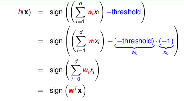
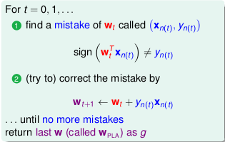
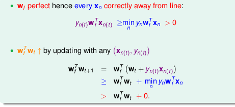
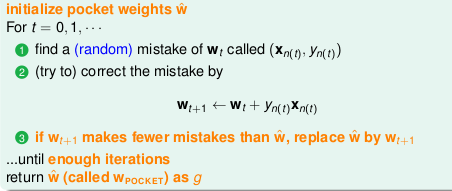

# Lecture 2: Learning to Answer Yes/No

## 1. Perceptron Hypothesis Set -- hyperplanes/linear classifiers in ![R^d][1]
![X][2]

![Y][3]

## 2. Percepptron Learning Algorithm (PLA) -- correct mistakes and improve iteratively
Start from some ![W0][4] (say, `0`), and 'correct' its mistakes on ![D][5]

## 3. Guarantee of PLA -- no mistake eventually if linear separable
### There are two cases: linear separable and not linear separable:

### if linear separable:
1. With the number of `t` increases, ![Wt][6] gradually moves closer to ![Wf][7].

next we need formular:

![f1][8] (1)

2.

next we need formular:

![f2][9] (2)

3. Prove that the number of iterations is limited.

From (1) we can see:

![f3][10]

From (2) we can see:

![f4][11]

So that the following equation can be obtained:

![f5][12]

When ![W0=0][14]:

![f6][13]

among them: ![img][15]

So evidence. (Because of the left of the above ≤ 1)

## 4. Non-Separable Data -- hold somewhat 'best' weights in pocket
#### More about PLA
- `Guarantee`: as long as linear separable and correct by mistake
  - inner product of ![Wf][7] and ![Wt][6] grows fast; length of ![Wt][6] grows slowly
  - PLA 'lines' are more and more aligned with ![Wf][7] => halts
- `Pros`: simple to implement, fast, works in any dimension ![d][16]
- `Cons`:
  - 'assumes' linear separable ![D][5] to halt
  - not fully sure how long halting takes

### if not linear separable:
modify PLA Algorithm by keeping best weights in pocket.

The efficiency is much slower than PLA.

  [1]: http://chart.apis.google.com/chart?cht=tx&chl=\mathbb{R}^d
  [2]: http://chart.apis.google.com/chart?cht=tx&chl=X%3D%5Cbegin%7Bbmatrix%7D1%26x_1%5E1%26x_2%5E1%26%5Ccdots%26x_d%5E1%5C%5C1%26x_1%5E2%26x_2%5E2%26%5Ccdots%26x_d%5E2%5C%5C%5Cvdots%26%5Cvdots%26%5Cvdots%26%5Cddots%26%5Cvdots%5C%5C1%26x_1%5Ej%26x_2%5Ej%26%5Ccdots%26x_d%5Ej%5C%5C%5Cend%7Bbmatrix%7D
  [3]: http://chart.apis.google.com/chart?cht=tx&chl=%5Cmathcal%7BY%7D%3A%5C%7B%2B1(good)%2C-1(bad)%5C%7D
  [4]: http://chart.apis.google.com/chart?cht=tx&chl=W_0
  [5]: http://chart.apis.google.com/chart?cht=tx&chl=\mathcal{D}
  [6]: http://chart.apis.google.com/chart?cht=tx&chl=W_t
  [7]: http://chart.apis.google.com/chart?cht=tx&chl=W_f
  [8]: http://chart.apis.google.com/chart?cht=tx&chl=w_f%5ETw_%7Bt%2B1%7D%5Cge%20w_f%5ETw_t%2Bmin_ny_nw_f%5ETx_n
  [9]: http://chart.apis.google.com/chart?cht=tx&chl=%7C%7Cw_%7Bt%2B1%7D%7C%7C%5E2%5Cleq%20%7C%7Cw_t%7C%7C%5E2%2Bmax_n%7C%7Cx_n%7C%7C%5E2
  [10]: http://chart.apis.google.com/chart?cht=tx&chl=w_f%5ETw_%7BT%7D%5Cge%20w_f%5ETw_%7BT-1%7D%2Bmin_ny_nw_f%5ETx_n%5Cge%5Cdots%5Cge%20w_f%5ETw_%7B0%7D%2BT%5Ccdot%20min_ny_nw_f%5ETx_n
  [11]: http://chart.apis.google.com/chart?cht=tx&chl=%7C%7Cw_%7BT%7D%7C%7C%5E2%5Cleq%20%7C%7Cw_%7BT-1%7D%7C%7C%5E2%2Bmax_n%7C%7Cx_n%7C%7C%5E2%5Cle%5Cdots%5Cleq%20%7C%7Cw_%7B0%7D%7C%7C%5E2%2BT%5Ccdot%20max_n%7C%7Cx_n%7C%7C%5E2%5Cto%20%7C%7Cw_T%7C%7C%5Cle%5Csqrt%7BT%7Dmax_n%7C%7Cx_n%7C%7C
  [12]: http://chart.apis.google.com/chart?cht=tx&chl=%5Cfrac%7Bw_f%5ETw_T%7D%7B%7C%7Cw_f%7C%7C%5Ccdot%7C%7Cw_T%7C%7C%7D%5Cge%5Cfrac%7Bw_f%5ETw_%7B0%7D%2BT%5Ccdot%20min_ny_nw_f%5ETx_n%7D%7B%7C%7Cw_f%7C%7C%5Ccdot%7C%7Cw_T%7C%7C%7D%5Cge%5Cfrac%7Bw_f%5ETw_%7B0%7D%2BT%5Ccdot%20min_ny_nw_f%5ETx_n%7D%7B%7C%7Cw_f%7C%7C%5Ccdot%5Csqrt%7BT%7Dmax_n%7C%7Cx_n%7C%7C%7D
  [13]: http://chart.apis.google.com/chart?cht=tx&chl=%5Cfrac%7Bw_f%5ETw_T%7D%7B%7C%7Cw_f%7C%7C%5Ccdot%7C%7Cw_T%7C%7C%7D%5Cge%5Cfrac%7BT%5Ccdot%20min_ny_nw_f%5ETx_n%7D%7B%7C%7Cw_f%7C%7C%5Ccdot%5Csqrt%7BT%7Dmax_n%7C%7Cx_n%7C%7C%7D%5Cto%20T%5Cle%20%5Cfrac%7BR%5E2%7D%7B%5Crho%5E2%7D
  [14]:http://chart.apis.google.com/chart?cht=tx&chl=w_0=0
  [15]:http://chart.apis.google.com/chart?cht=tx&chl=R%5E2%3Dmax_n%7C%7Cx_n%7C%7C%5E2%2C%20%5Crho%3Dmin_ny_n%5Cfrac%7Bw_f%5ET%7D%7B%7C%7Cw_f%7C%7C%7Dx_n
  [16]: http://chart.apis.google.com/chart?cht=tx&chl=d

