# Chapter 20: Unicast Routing
## Introduction
Unicast routing in the Internet, with a large number of routers and a huge number of hosts, can be done only by using hierarchical routing: routing in several steps using different routing algorithms.

### General Idea
In unicast routing, a packet is routed, hop by hop, from its source to its destination by the help of forwarding tables. There are several routes that a packet can travel from the source to the destination; what must be determined is which route the packet should take.

An internet is modeled as a *weighted graph*, in which each edge is associated with a cost.

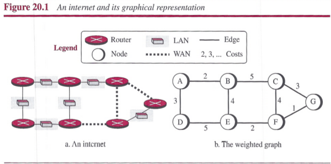

### Least-Cost Routing
The source router chooses a route to the destination router in such a way that the total cost for the route is the least cost among all possible routes.

##### Least-Cost Trees
A least-cost tree is a tree with the source router as the root that spans the whole graph (visits all other nodes) and in which the path between the root and any other node is the shortest. In this way, we can have only one shortest-path tree for each node; we have N least-cost trees for the whole internet.


## Routing Algorithms
### Distance-Vector Routing
In `distance-vector (DV) routing`, the first thing each node creates is its own least-cost tree with the rudimentary information it has about its immediate neighbors. The incomplete trees are exchanged between immediate neighbors to make the trees more and more complete and to represent the whole internet.

##### Bellman-Ford Equation
This equation is used to find the least cost between a source node, and a distination node, through some intermediary nodes.


##### Distance Vectors
Distance-vector routing unglues these paths and creates a distance vector, a one-dimensional array to represent the tree.

Each node in an internet, when it is booted, creates a very rudimentary distance vector with the minimum information the node can obtain from its neighborhood.

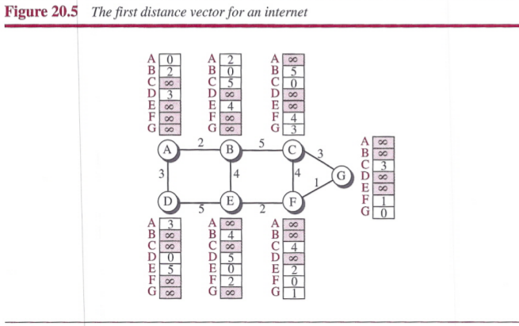

After each node has created its vector, it sends a copy of the vector to all its immediate neighbors. After a node receives a distance vecter from a neighbor, it updates its distance vector using the Bellman-Ford equation.

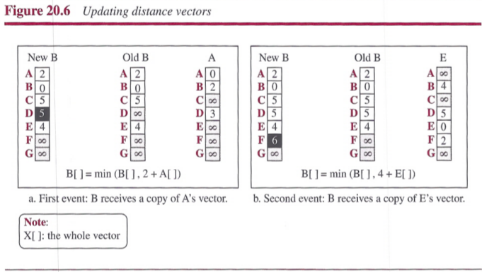

We need to remember that after updating a node, it immediately sends its updated vector to all neighbors.

##### Distance-Vector Routing Algorithm
```
Distance_Vector_Routing()
{
    // Initialize (create initial vectors for the node)
    D[myself] = 0
    for (y = 1 to N)
    {
        if (y is a neighbor)
            D[y] = c[myself][y]
        else
            D[y] = ∞
    }
    send vector {D[1], D[2], ..., D[N]} to all neighbors
    // Update (improve the vector with the vector received from a neighbor)
    repeat (forever)
    {
        wait (for a vector Dw from a neighbor w or any change in the link)
        for (y = 1 to N)
        {
            D[y] = min[D[y], (c[myself][w] + Dw[y])]    // Bellman-Ford equation
        }
        if (any change in the vector)
            send vector {D[1], D[2], ..., D[N]} to all neighbors
    }
} // End of Distance Vector
```

**Two-Node Loop**: One example of `count to infinity` is the `two-node loop` problem. The two-node instability can be avoided using `split horizon` combined with `poison reverse`.


### Link-State Routing
`Link-state (LS) routing` uses the term `link-state` to define the characteristic of a link (an edge) that represents a network in the internet. In this algorithm the cost associated with an edge defines the state of the link.

##### Link-State Databases (LSDB)
To create a least-cost tree with this method, each node needs to have a complete map of the networ , which means it needs to know the state of each link. The collection of states for all links is called the `link-state database (LSDB)`.

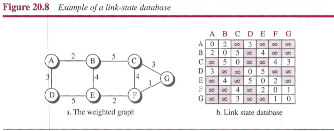

Each node can send some greeting messages to all its immediate neighbors to collect two pieces of information for each neighboring node: the identity of the node and the cost of the link. The combination of these two pieces of informationlis called the LS packet (LSP); the LSP is sent out of each interface.


##### Formation of Least-Cost Trees
To create a least-cost tree for itself, using the shared LSDB, each node needs to run the famous `Dijkstra Algorithm`.
1. The node chooses itself as the root of the tree, creating a tree with a single node, and sets the total cost of each node based on the information in the LSDB.
2. The node selects one node, among all nodes not in the tree, which is closest to the root, and adds this to the tree. After this node is added to the tree, the cost of all other nodes not in the tree needs to be updated because the paths may have been changed.
3. The node repeats step 2 until all nodes are added to the tree.

```
Dijkstra's Algorithm()
{
    // Initialization
    Tree = {root}               // Tree is made only of the root
    for (y = 1 to N)            // N is the number of nodes
    {
        if (y is the root)
            D[y] = 0            // D[y] is shortest distance from root to node y
        else if (y is a neighbor)
            D[y] = c[root][y]   // c[x][y] is cost between nodes x and y in LSDB
        else
            D[y] = ∞
    }
    // Calculation
    repeat
    {
        find a node w, with D[w] minimum among all nodes not in the Tree
        Tree = Tree ∪ {w}       // Add w to tree
        // Update distances for all neighbors of w
        for (every node x, which is a neighbor of w and not in the Tree)
        {
            D[x] = min{D[x], (D[w] + c[w][x])}
        }
    } until (all nodes included in the Tree)
} // End of Dijkstra
```


### Path-Vector Routing
To provide safety, security, and to allow the packet to reach its destination more efficiently without assigning costs to the route, `path-vector (PV) routing` has been devised. The best route is determined by the source using the policy it imposes on the route.

##### Spanning Trees
In path-vector routing, the path from a source to all destinations is also determined by the best spanning tree.

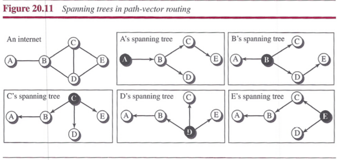

##### Creation of Spanning Trees
When  a node is booted, it creates a path vector based on the information it can obtain about its immediate neighbor.


Each node, after the creation of the initial path vector, sends it to all its immediate neighbors. Each node, when it receives a path vector from a neighbor, updates its path vector using an equation similar to the Bellman-Ford, but applying its own policy instead of looking for the least cost.


##### Path-Vector Algorithm
```
Path_Vector_Routing()
{
    // Initialization
    for (y = 1 to N)
    {
        if (y is myself)
            Path[y] = myself
        else if (y is a neighbor)
            Path[y] = myself + neighbor node
        else
            Path[y] = empty
    }
    Send vector {Path[1], Path[2], ..., Path[y]} to all neighbors
    // Update
    repeat (forever)
    {
        wait (for a vector Pathw from a neighbor w)
        for (y = 1 to N)
        {
            if (Pathw includes myself)
                discard the path        // Avoid any loop
            else
                Path[y] = best {Path[y], (myself + Pathw[y])}
        }
        If (there is a change in the vector)
            Send vector {Path[1], Path[2], ..., Path[y]} to all neighbors
    }
} // End of Path Vector
```


## Unicast Routing Protocols
### Routing Information Protocol (RIP)
The `Routing Information Protocol (RIP)` is based on the distance-vector routing algorithm.

##### Hop Count
The cost is defined as the number of hops, which means the number of networks a packet needs to travel through from the source router to the final destination host. However, the maximum cost of a path can be 15.

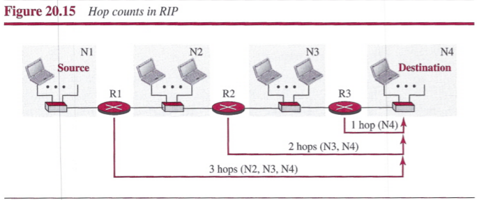

##### Forwarding Tables
A forwarding table in RIP is a three-column table in which the first column is the address of the destination network, the second column is the address of the next router to which the packet should be forwarded, and the third column is the cost to reach the destination network.


##### RIP Implementation
RIP is implemented as a process that uses the service of UDP on the well-known port number 520. Although RIP is a routing protocol to help IP route its datagrams through the AS, the RIP messages are encapsulated inside UDP user datagrams, which in turn are encapsulated mside IP datagrams. RIP has gone through two versions: RIP-1 and RIP-2.

**RIP Messages**: Two RIP processes, a client and a server need to exchange messages. Part of the message, which we call `entry`, can be repeated as needed in a message. Each entry carries tre information related to one line in the forwarding table of the router that sends the message.

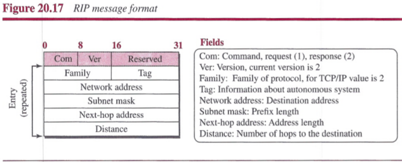

RIP Ihas two types of messages: `request` and `response`.
- A request message is sent by a router that has just come up or by a router that has some time-out entries. A request message can ask about specific entries or all entries.
- A response message can be either solicited or unsolicited. A solicited response message is sent only in answer to a request message. It contains information about the destination specified in the corresponding request message. An unsolicited response message is sent periodically, every 30 seconds or when there is a change in the forwardirg table.

**RIP Algorithm**: RIP implements the distance-vector routing algorithm but some changes need to be made to enable a router to update its forwarding table:
- Instead of sending only distance vectors, a router needs to send the whole contents of its forwarding table in a response message.
- The receiver adds one hop to each cost and changes the next router field to the address of the sending router. The received router selects the old routes as the new ones except in the following three cases:
 - If the received route does not exist in the old forwarding table, it should be added to the route.
 - If the cost of the received route is lower than the cost of the old one, the received route should be selected as the new one.
 - If the cost of the received route is higher than the cost of the old one, but the value of the next router is the same in both routes, the received route should be selected as the new one. This is the case where the route was actually advertised by the same router in the past, but now the situation has been changed.
- The new forwarding table needs to be sorted according to the destination route.

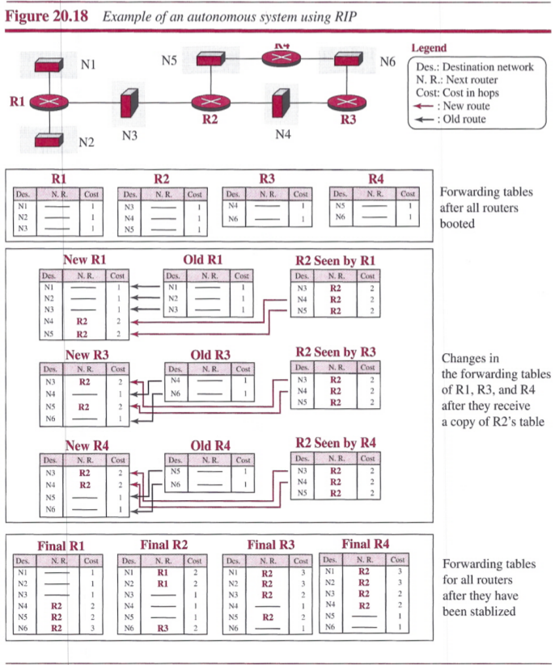

**Timers in RIP**: RIP uses three timers to support its operation.
- The `periodic timer` controls the advertising of regular update messages.
- The `expiration timer` governs the validity of a route.
- The `garbage collection timer` is used to purge a route from the forwarding table.

### Open Shortest Path First (OSPF)
`Open Shortest Path First (OSPF)` is based on the link-state routing protocol.

##### Metric
In OSPF, like RIP, the cost of reaching a destination from the host is calculated from the source router to the destination network. However, each link can be assigned a weight based on the throughput, round-trip time, reliability, and so on.

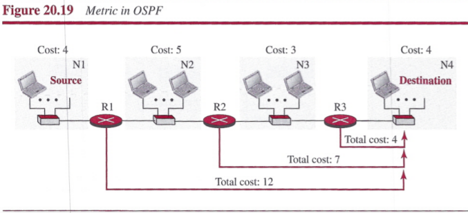

##### Forwarding Tables
Each OSPF router can create a forwarding table after finding the shortest-path tree between itself and the destination using Dijkstra's algorithm.

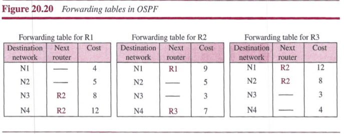

##### Areas
The formation of shortest-path trees in OSPF requires that all routers flood the whole AS with their LSPs to creat the global LSDB. The AS is divided into small sections called `areas`. One of the areas in the AS is designated as the `backbone area`, responsible for gluing the areas together.

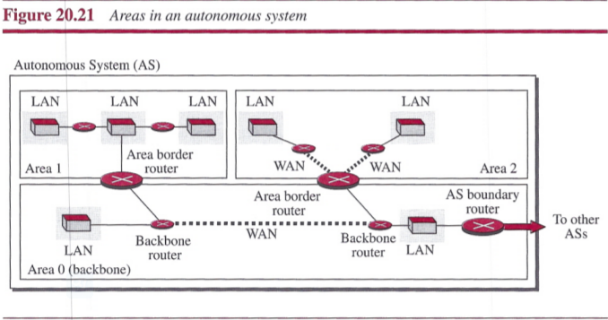

##### Link-State Advertisement
We need different types of advertisements, each capable of advertising different situations.

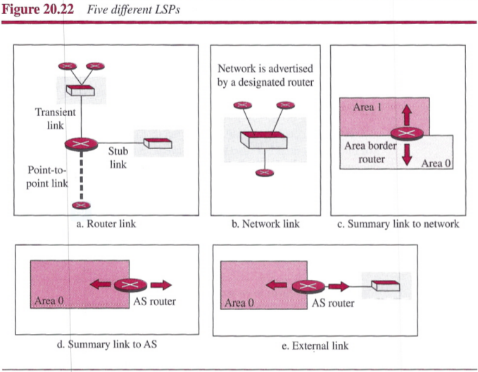

- `Router link`
 - A `transient link` announces a link to a transient network, a network that is connected to the rest of the networks by one or more routers.
 - A `stub link` advertises a link to a stub network, a network that is not a through network.
 - A `point-to-point link` should define the address of the router at the end of the point-to-point line and the cost to get there.
- `Network link`
- `Summary link to network`
- `Summary link to AS`
- `External link`

##### OSPF Implementation
OSPF is implemented as a program in the network layer, using the service of the IP for propagation. An IP datagram that carries a message from OSPF sets the value of the protocol field to 89.

**OSPF Messages**: OSPF uses five types of messages.
- The `hello message` (type 1) is used by a router to introduce itself to the neighbors and announce all neighbors that it already knows.
- The `database description message` (type 2) is normally sent in response to the hello message to allow a newly joined router to acquire the full LSDB.
- The `link-state request message` (type 3) is sent by a router that needs information about a specific LS.
- The `link-state update message` (type 4) is the main OSPF message used for building the LSDB.
- The `link-state acknowledgment message` (type 5) is used to create reliabilit in OSPF.

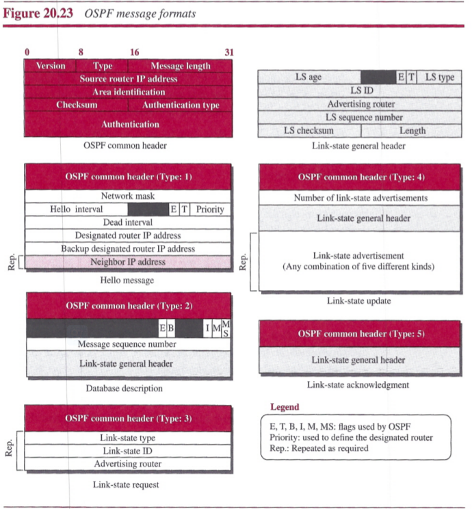

**OSPF Algorithm**: OSPF implements the link-state routing algorithm but some changes need to be added:
- After each router has created the shortest-path tree, the algorithm needs to use it to create the corresponding routing algorithm.
- The algorithm needs to be augmented to handle sending and receiving all five types of messages.

### Border Gateway Protocol Version 4 (BGP4)
The `Border Gateway Protocol version 4 (BGP4)` is based on the path-vector algorithm.

- interdomain routing protocol: BGP4
- intradomain routing protocol: RIP, OSPF

##### Operation of External BGP (eBGP)
The eBGP variation of BGP allows two physically connected border routers in two different ASs to form pairs of eBGP speakers and exchange messages. However, there is a need for a logical TCP connection to be created to make the exchange of information possible. Each logical connectionlin BGP parlance is referred to as a session.

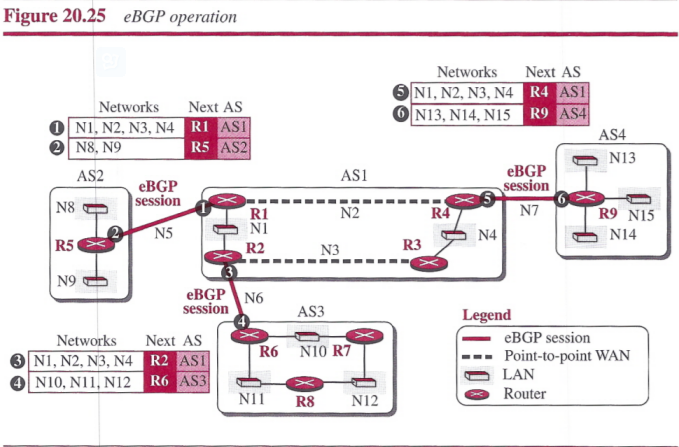

There are two problems that need to be addressed:
- Some border routers do not know how to route a packet destined for nonneighbor ASs.
- None of the nonborder routers know how to route a packet destined for any networks in other ASs.

##### Operation of Internal BGP (eBGP)
The iBGP protocol is similar to the eBGP protocol in that it uses the service of TCP on the well-known port 179, but it creates a session between any possible pair of routers inside an autonomous system.
- if an AS has only one router, there cannot be an iBGP session.
- if there are n routers in an autonomous system, there should be [n x (n - 1) / 2] iBGP sessions in that autonomous system to prevent loops in the system.


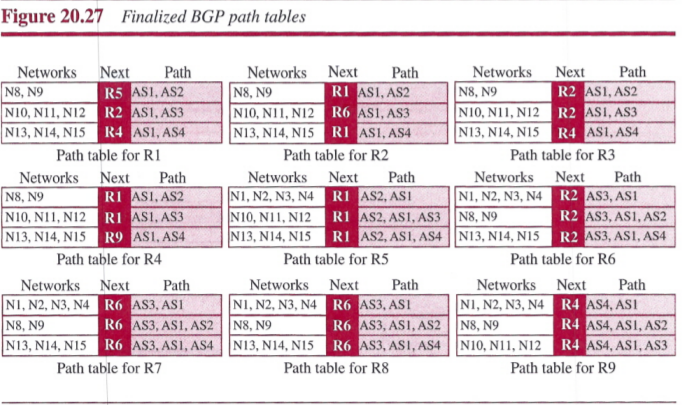

##### Injection of Information into Intradomain Routing
The role of an interdomain routing protocol such as BGP is to help the routers inside the AS to augment their routing information. The cost is seted to the foreign networks at the same cost value as to reach the first AS in the path.
- In the case of a stub AS, the only area border router adds a default entry at the end of its forwarding table and defines the next router to be the speaker router at the end of the eBGP connection.
- In the case of a transient AS, it needs to inject the whole contents of the path table.

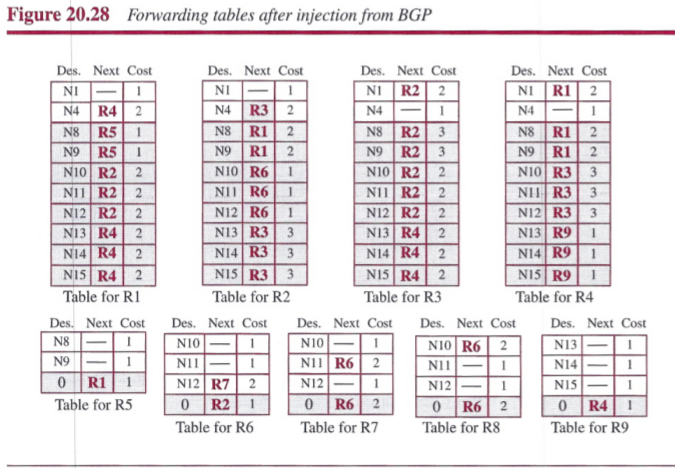

##### Path Attributes
BGP allows a destination to be associated with up to seven path attributes. Path attri are divided into two broad categories: `well-known` and `optional`. All attributes are inserted after the corresponding destination prefix in an update message.

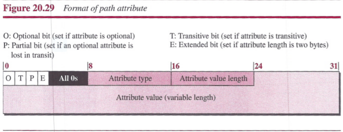

##### Route Selection


##### Messages
BGP uses four types of messages for communication between the BGP speakers across the ASs and inside an AS:
- `Open Message`: To create a neighborhood relationship, a router running BGP opens a TCP connection with a neighbor and sends an open message.
- `Update Message`: It is used by a router to withdraw destinations that have been advertised previously, to announce a route to a new destination, or both.
- `Keepalive Message`: The BGP peers that are running exchange keepalive messages regularly to tell each other that they are alive.
- `Notification`: A notification message is sent by a router whenever an error condition is defected or a router wants to close the session.

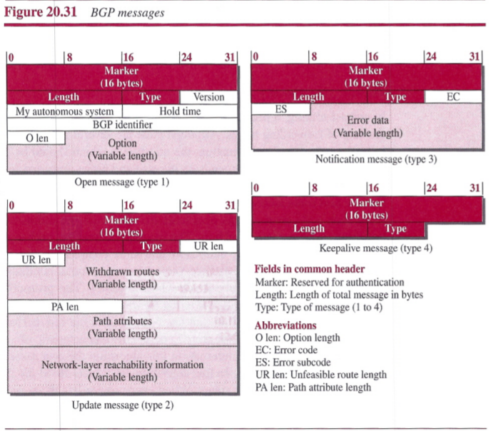

## Summary
- In unicast routing, a packet is routed, hop by hop, from its source to its destination by the help of forwarding tables.
- Although there are several routes that a packet can travel from the source to the destination, the question is which should be the best. The interpretation of the term best depends on the cost and policy imposed on the trip.
- Several routing algorithms, and the corresponding protocols, have been devised to find the bet route among them; three have survived.
- In distance-vector routing, the first thing each node creates is its own least-cost tree with the rudimentary information it has about its immediate neighbors. The incomplete trees are exchanged between immediate neighbors to make the trees more and more complete and to represent the whole internet. In other words, in distance-vector routing, a router continuously tells all of its neighbors that it knows about the whole internet. The protocol that implements distance-vector routing is called Routing Information Protocol (RIP).
- Another routing algorithm that has been used in the Internet is link-state routing. This method uses the term link-state to define the characteristic of a link (an edge) that represents a network in the internet. In this algorithm the cost associated with an edge defines the tate of the link. In this algorithm, all routers flood the internet, with information related to their link states. When every router has the complete picture of the states, a link-state database can be created. The least-cost tree for each router and the corresponding forwarding table can be made from the link-state database. A protocol that implements link-state routing is called Open Shortest Path First (OSPF).
- Both link-state and distance-vector routing are based on the least-cost goal. However, there are instances where this goal is not the priority. Path-vector routing algorithms have been designed for this purpose. We can always insert policies in the forwarding table by preventing a packet from visiting a specific router. In path-vector routing, the best route from the source is the best path, the one that complies with the policy imposed, The protocol that implements path-vector routing is the Border Gateway Protocot (BGP).
