# Chapter 6: Bandwidth Utilization: Multiplexing and Spectrum Spreading
- In `multiplexing`, our goal is efficiency; we combine several channels into one.
- In `spectrum spreading`, our goals are privacy and antijamming; we expand the bandwidth of a channel to insert redundancy.

## Multiplexing
`Multiplexing` is the set of techniques that allow the simultaneous transmission of multiple signals across a single data link.

The lines on the left direct their transmission streams to a `multiplexer (MUX)`, which combines them into a single stream (many-to-one). At the receiving end, that stream is fed into a `demultiplexer (DEMUX)`, which separates the stream back into its component transmissions (one-to-many) and directs them to their corresponding lines. The word link refers to the physical path. The word `channel` refers to the portion of a link that carries a transmission between a given pair of lines. One link can have many (*n*) channels.

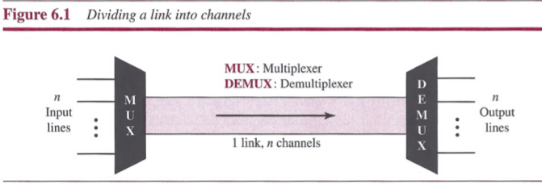

There are three basic multiplexing techniques: `frequency-division multiplexing`, `wavelength-division multiplexing`, and `time-division multiplexing`.

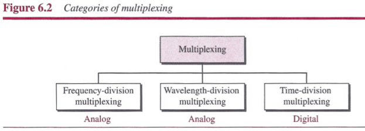

### Frequency-Division Multiplexing
`Frequency-division multiplexing (FDM)` is an analog technique that can be applied when the bandwidth of a link (in hertz) is greater than the combined bandwidths of the signals to be transmitted.

FDM is an analog multiplexing technique that combines analog signals.

##### Multiplexing Process

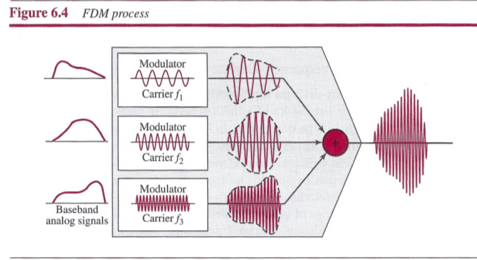

##### Demultiplexing Process

### Wavelength-Division Multiplexing
`Wavelength-division multiplexing (WDM)` is designed to use the high-data-rate capability of fiber-optic cable.

WDM is an analog multiplexing technique to combine optical signals.

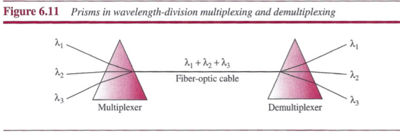

### Time-Division Multiplexing
`Time-division multiplexing (TDM)` is a digital process that allows several connections to share the high bandwidth of a link.

TDM is a digital multiplexing technique for combining several low-rate channels into one high-rate one.

We can divide TDM into two different schemes:
- `synchronous TDM`
- `statistical TDM`

##### Synchronous TDM
In synchronous TDM, each input connection has an allotment in the output even if it is not sending data.

**Time Slots and Frames**: In synchronous TDM, the data flow of each input connection is divided into units. Each input unit becomes one output unit and occupies one output time slot. However, the duration of an output time slot is *n* times shorter than the duration of an input time slot. Time slots are grouped into frames. A frame consists of one complete cycle of time slots.

In synchronous TDM, the data rate of the link is *n* times faster, and the unit duration is *n* times shorter.

**Empty Slots**: If a source does not have data to send, the corresponding slot in the output frame is empty.

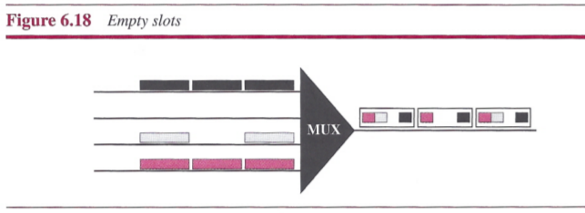

**Data Rate Management**: if data rates are not the same, three strategies, or a combination of them, can be used.
- `Multilevel Multiplexing`: a technique used when the data rate of an input line is a multiple of others.

 

- `Multiple-Slot Allocation`: Sometimes it is more efficient to allot more than one slot in a frame to a single input line.

 

- `Pulse Stuffing`: make the highest input data rate the dominant data rate and then add dummy bits to the input lines with lower rates.

 

**Frame Synchronizing**: one or more synchronization bits are usually added to the beginning of each frame. These bits, called `framing bits`, follow a pattern, frame to frame, that allows the demultiplexer to synchronize with the incoming stream so that it can separate the time slots accurately.

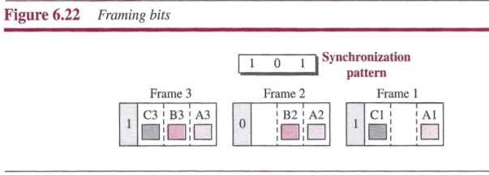

##### Statistical Time-Division Multiplexing
In statistical time-division multiplexing, slots are dynamically allocated to improve bandwidth efficiency. Only when an input line has a slot's worth of data to send is it given a slot in the output frame.

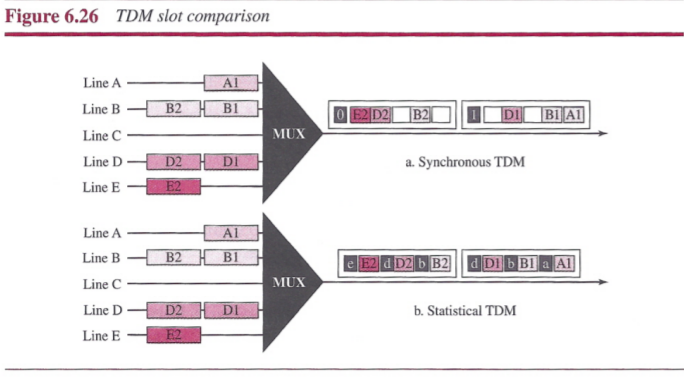

**Addressing**: An output slot in synchronous TDM is totally occupied by data; in statistical TDM, a slot needs to carry data as well as the address of the destination.

## Spread Spectrum
`Spread spectrum` is designed to be used in wireless applications (LANs and WANs). The expanded bandwidth allows the source to wrap its message in a protective envelope for a more secure transmission.

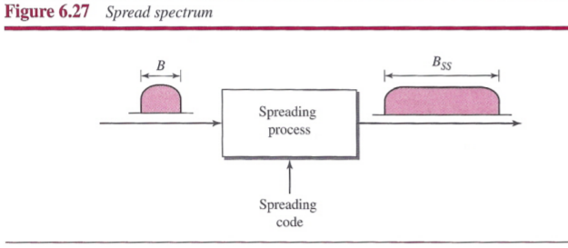

Spread spectrum achieves its goals through two principles:
1. The bandwidth allocated to each station needs to be, by far, larger than what is needed. This allows redundancy.
2. The expanding of the original bandwidth *B* to the bandwidth *Bss* must be done by a process that is independent of the original signal. In other words, the spreading process occurs after the signal is created by the source.

### Frequency Hopping Spread Spectrum
The `frequency hopping spread spectrum (FHSS)` technique uses *M* different carrier frequencies that are modulated by the source signal.

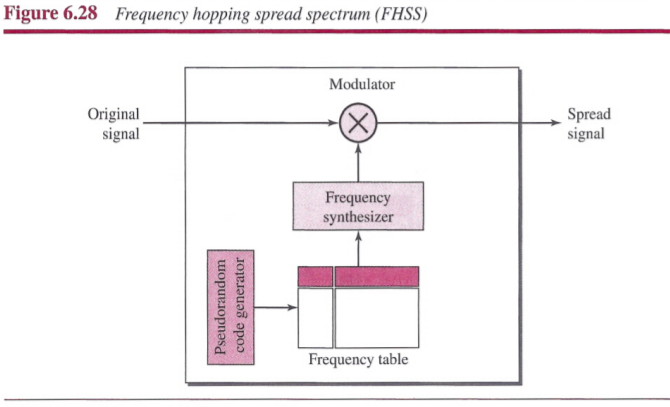

A `pseudorandom code generator`, called `pseudorandom noise (PN)`, creates a *k*-bit pattern for every `hopping period` *Th*. The frequency table uses the pattern to find the frequency to be used for this hopping period and passes it to the frequency synthesizer. The frequency synthesizer creates a carrier signal of that frequency, and the source signal modulates the carrier signal.

##### Bandwidth Sharing
If the number of hopping frequencies is *M*, we can multiplex *M* channels into one by using the same *Bss* bandwidth. This is possible because a station uses just one frequency in each hopping period; (*M* - 1) other frequencies can be used by (*M* - 1) other stations.

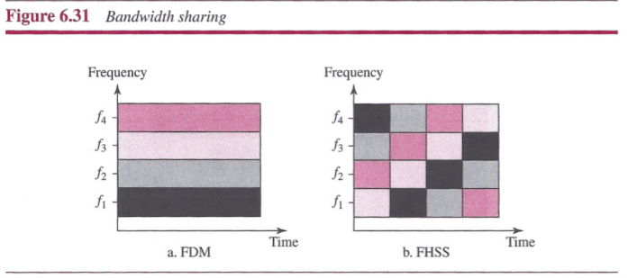

### Direct Sequence Spread Spectrum
In `direct sequence spread spectrum (DSSS)`, we replace each data bit with *n* bits using a spreading code. In other words, each bit is assigned a code of *n* bits, called `chips`, where the chip rate is *n* times that of the data bit.

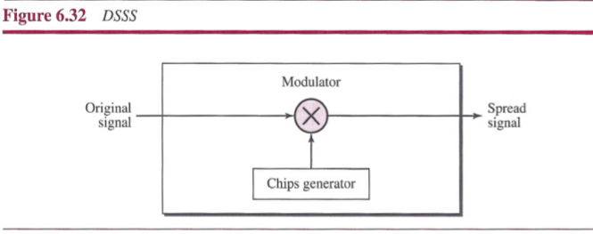

## Summary
- Bandwidth utilization is the use of available bandwidth to achieve specific goals. Efficiency can be achieved by using multiplexing; privacy and antijamming can be achieved by using spreading.
- Multiplexing is the set of techniques that allow the simultaneous transmission of multiple signals across a single data link. In a multiplexed system, n lines share the bandwidth of one link. The word link refers to the physical path. The word channel refers to the portion of a link that carries a transmission.
- There are three basic multiplexing techniques: frequency-division multiplexing, wavelength-division multiplexing, and time-division multiplexing. The first two are techniques designed for analog signals, the third, for digital signals.
- Frequency-division multiplexing (FDM) is an analog technique that can be applied when the bandwidth of a link (in hertz) is greater than the combined bandwidths of the signals to be transmitted.
- Wavelength-division multiplexing (WDM) is designed to use the high bandwidth capability of fiber-optic cable. WDM is an analog multiplexing technique to combine optical signals.
- Time-division multiplexing (TDM) is a digital process that allows several connections to share the high bandwidth of a link. TDM is a digital multiplexing technique for combining severallow-rate channels into one high-rate one.
- We can divide TDM into two different schemes: synchronous or statistical. In synchronous TDM, each input connection has an allotment in the output even if it is not sending data. In statistical TDM, slots are dynamically allocated to improve bandwidth efficiency.
- In spread spectrum (SS), we combine signals from different sources to fit into a larger bandwidth. Spread spectrum is designed to be used in wireless applications in which stations must be able to share the medium without interception by an eavesdropper and without being subject to jamming from a malicious intruder.
- The frequency hopping spread spectrum (FHSS) technique uses M different carrier frequencies that are modulated by the source signal. At one moment, the signal modulates one carrier frequency; at the next moment, the signal modulates another carrier frequency.
- The direct sequence spread spectrum (DSSS) technique expands the bandwidth of a signal by replacing each data bit with n bits using a spreading code. In other words, each bit is assigned a code of n bits, called chips.
